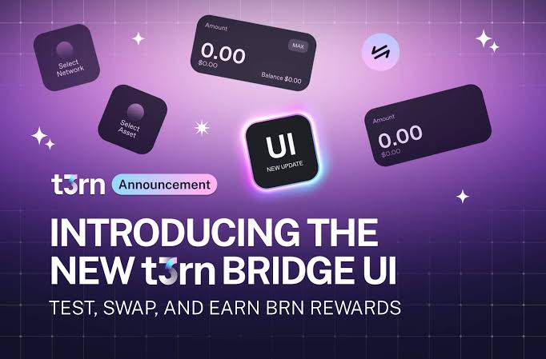

# T3RN BRIDGE BOT



A bot designed to automate transactions and bridge assets on the t3rn network, making the process seamless and efficient. Now supports both Optimism Sepolia and Arbitrum Sepolia testnets.

**Register : [T3rn Airdrop](https://bridge.t1rn.io/)**

## BOT FEATURE

- Multi Account Support
- Auto Swap Betwen OP > ARB OR ARB > OP

## PREREQUISITE

- Git
- Node JS
- OP Sepolia ETH BALANCE / ARB Sepolia ETH BALANCE Depends on Config.

## SETUP & CONFIGURE BOT

### LINUX & MAC OS

- Install Prerequites:
  ```
  curl -o- https://raw.githubusercontent.com/nvm-sh/nvm/v0.40.0/install.sh | bash
  echo 'export NVM_DIR="$HOME/.nvm"' >> $HOME/.bash_profile
  echo '[ -s "$NVM_DIR/nvm.sh" ] && \. "$NVM_DIR/nvm.sh"  # This loads nvm' >> $HOME/.bash_profile
  echo '[ -s "$NVM_DIR/bash_completion" ] && \. "$NVM_DIR/bash_completion"  # This loads nvm bash_completion' >> $HOME/.bash_profile
  source $HOME/.bash_profile
  nvm install --lts
  node -v
  npm -v
  sudo apt-get update
  sudo apt-get upgrade
  ```

1. Clone project repository
   ```
   git clone https://github.com/rmndkyl/t3rn-bot-bridge.git && cd t3rn-bot-bridge
   ```
2. Install dependencies
   ```
   npm install
   ```
3. Copy all folder
   ```
   cp accounts/accounts_tmp.js accounts/accounts.js && cp config/config_tmp.js config/config.js
   ```
4. Configure the accounts
   ```
   nano accounts/account.js
   ```
   Setup your accounts using PK or Seed
5. Configure the config
   ```
   nano config.js
   ```
   Setup your config using OP / ARB
6. To start the app run 
   ```
   npm run start
   ```
   
### WINDOWS

1. Open your `Command Prompt` or `Power Shell`.

2. Clone project repository
   ```
   git clone https://github.com/rmndkyl/t3rn-bot-bridge.git && cd t3rn-bot-bridge
   ```

3. Install dependencies
   ```
   npm install
   ```

4. Navigate to `t3rn-bridge-bot` directory. 

5. Navigate to `accounts` directory and rename `accounts_tmp.js` to `accounts.js`.

6. Open `accounts.js` and setup your wallet.

7. Navigate to `config` directory and rename `config_tmp.js` to `config.js`

8. Open `config.js` and setup your ETH Balance OP/ARB.

9. Now back to the `t3rn-bridge-bot` folder.

10. Copy `config` and `accounts` folder to `app` folder.

11. To start the app open your `Command Prompt` or `Power Shell` again and run.
    ```
    node app/index.js
    ```
   

## UPDATE BOT

To update bot follow this step :
1. Run
   ```
   git pull
   ```
   or 
   ```
   git pull rebase
   ```
   If error run
   ```
   git stash && git pull
   ```
2. Run
   ```
   npm update
   ```

3. Start the bot.

## NOTE

**You can configure:**
- Amount to Bridge
- Network
- Bridge Contract
- Raw Data
On Config File

If you did'nt get BRN Point, change the config OP or ARB RAW DATA with yours. Where to get it ? do manual TX from ARB to OP or OP to ARB, and go to explorer and copy the Input Data as HEX. Or you can just copy paste from wallet confirmation approval on input / data section.

## ☕️ Traktir kopinya & Thanks for Supporting us:

- https://sociabuzz.com/layerairdrop/tribe
- https://saweria.co/LayerAirdrop
- https://trakteer.id/layerairdrop/tip
- **EVM : `0x3E0BD1156172c03E497157838f218CDF77Ab2885`**
- **SOLANA : `4DMvckFnSrm7fymVaPrXULrCq4h1yvfTWq5aHXLpLKsn`**

## LICENSE

This project is licensed under the MIT License - see the [LICENSE](LICENSE) file for details.

---
